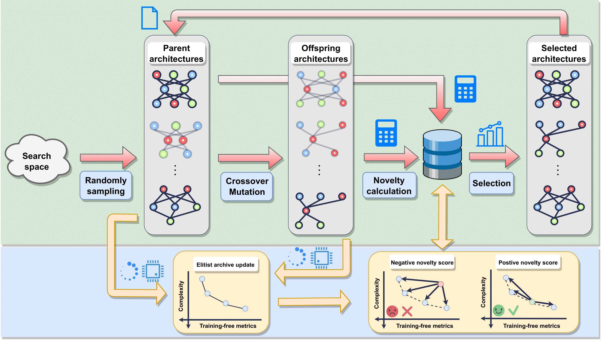

# Efficient Multi-Objective Neural Architecture Search via Pareto Dominance-based Novelty Search
[](LICENSE)

An Vo, Ngoc Hoang Luong.

in The Genetic and Evolutionary Computation Conference (GECCO) 2024.

**Abstract**: Neural Architecture Search (NAS) aims to automate the discovery of high-performing deep neural network architectures. Traditional objective-based NAS approaches typically optimize a certain performance metric (e.g., prediction accuracy), overlooking large parts of the architecture search space that potentially contain interesting network configurations. Furthermore, objective-driven population-based metaheuristics in complex search spaces often quickly exhaust population diversity and succumb to premature convergence to local optima. This issue becomes more complicated in NAS when performance objectives do not fully align with the actual performance of the candidate architectures, as is often the case with training-free metrics. While training-free metrics have gained popularity for their rapid performance estimation of candidate architectures without incurring computation-heavy network training, their effective incorporation into NAS remains a challenge. This paper presents the Pareto Dominance-based Novelty Search for multi-objective NAS with Multiple Training-Free metrics (**MTF-PDNS**). Unlike conventional NAS methods that optimize explicit objectives, MTF-PNDS promotes population diversity by utilizing a novelty score calculated based on multiple training-free performance and complexity metrics, thereby yielding a broader exploration of the search space. Experimental results on standard NAS benchmark suites demonstrate that MTF-PDNS outperforms conventional methodls driven by explicit objectives in terms of convergence speed, diversity maintenance, architecture transferability, and computational costs.




## Installation

- Clone this repository
- Install packages
- Install [NAS-Bench-201](https://github.com/D-X-Y/NAS-Bench-201), [NAS-Bench-101](https://github.com/google-research/nasbench) and [NAS-Bench-1Shot1](https://github.com/automl/nasbench-1shot1)
- Download `benchmark_data` [here](https://drive.google.com/file/d/1phmIu72ElCsyBlcysuxX2REWzWMWliK8/view?usp=sharing)


## Usage
```shell
$ python main.py --method <method name> --dataset <dataset name> --performance_criteria <performance criteria> --pop_size <pop size>  --n_runs <number of runs> --n_gen <number of generations> --problem_name <problem name> 
```

| Method              | method_name | performance_criteria |
| :---------------- | :------ | :---- |
| MOENAS        |   MOENAS   | `val_acc` | 
| MOENAS-`synflow`/`jacov`/`snip` |   TF-MOENAS   | `synflow`/`jacov`/`snip` | 
| MTF-MOENAS    |  TF-MOENAS   | `synflow-jacov-snip` |
| PDNS        |   PDNS   | `val_acc` | 
| PDNS-`synflow`/`jacov`/`snip` |   TF-PDNS   | `synflow`/`jacov`/`snip` | 
| MTF-PDNS    |  TF-PDNS   | `synflow-jacov-snip` |

**Note**: To reproduce the paper results, `n_gen` should be set to 50 for NAS-Bench201 and 150 for NAS-Bench-101 and NAS-Bench-1Shot1.

Refer to `main.py` for more details.
Example commands for PDNS-`synflow`:
```shell
$ python main.py --method TF-PDNS --dataset cifar10 --performance_criteria synflow --pop_size 20 --n_runs 30 --n_gen 50 --problem_name NAS-Bench-201
```

## Citation

If you find this code is useful, please consider citing our paper:
```bibtex
@inproceedings{pdns-2024,
  author       = {An Vo and
                  Ngoc Hoang Luong},
  title        = {Efficient Multi-Objective Neural Architecture Search via Pareto Dominance-based Novelty Search},
  booktitle    = {Proceedings of the Genetic and Evolutionary Computation Conference,
                  {GECCO} 2024},
  year         = {2024},
}
```

